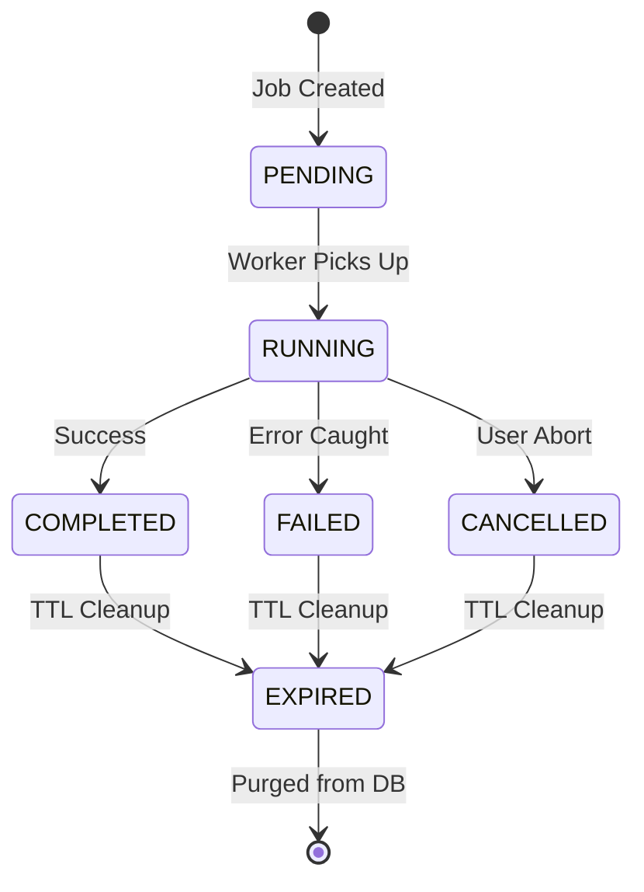

# ADR-ERP-004A — Asynchronous Long-Running Operations Framework

## Status
**APPROVED** (Implemented & Verified)

## Context
During the ERP-004 scalability audit, executing a direct Excel export of 300,000 records at the 1,000,000-record scale took **149.7 seconds (2.5 minutes)**. Because the export ran inside the main HTTP request loop, it:
1. Blocked the single-threaded Node.js event loop.
2. Saturated database connection pools.
3. Exceeded the 10-second client-side fetch timeouts, causing request failures.
4. Spiked process memory, risking Out-Of-Memory (OOM) crashes.

To scale StockPro, we must transition from synchronous request-response execution to an asynchronous background job processing model. Instead of a single-purpose export queue, we propose a generic, reusable **Asynchronous Long-Running Operations Job Framework** (Enterprise Job Framework).

---

## Architecture Design Proposal

### 1. Job Lifecycle State Machine
Jobs must transition through a strict state machine to support monitoring, failure handling, cancellations, and cleanup:



- **PENDING**: Job registered in database; waiting for worker availability.
- **RUNNING**: Worker has locked the job and is actively executing it.
- **COMPLETED**: Task completed successfully; result URL populated.
- **FAILED**: Execution failed; exception message and retry state captured.
- **CANCELLED**: Aborted by administrative request.
- **EXPIRED**: Cleaned up from database and disk storage based on TTL.

---

### 2. Database Schema Definition
A database-backed job store guarantees persistence, tracking, and recovery across server restarts without requiring Redis immediately. We can start with a PostgreSQL-backed job table:

```sql
CREATE TYPE job_status AS ENUM ('PENDING', 'RUNNING', 'COMPLETED', 'FAILED', 'CANCELLED', 'EXPIRED');

CREATE TABLE core_jobs (
    id UUID PRIMARY KEY DEFAULT gen_random_uuid(),
    type VARCHAR(50) NOT NULL, -- e.g., 'EXPORT_EXCEL', 'BULK_IMPORT', 'AI_EXTRACT'
    status job_status NOT NULL DEFAULT 'PENDING',
    owner_id UUID NOT NULL, -- Reference to user executing the action
    progress INTEGER NOT NULL DEFAULT 0 CHECK (progress >= 0 AND progress <= 100),
    payload JSONB, -- Job input parameters (e.g. filters, query options)
    result_url VARCHAR(512), -- Path to download generated assets (e.g., SQS/S3 or disk path)
    error_message TEXT, -- Error details if status is FAILED
    retry_count INTEGER NOT NULL DEFAULT 0,
    max_retries INTEGER NOT NULL DEFAULT 3,
    started_at TIMESTAMP WITH TIME ZONE,
    finished_at TIMESTAMP WITH TIME ZONE,
    created_at TIMESTAMP WITH TIME ZONE NOT NULL DEFAULT NOW(),
    expires_at TIMESTAMP WITH TIME ZONE NOT NULL -- TTL timestamp for automated purging
);

-- Indexing for fast queue fetching and status tracking
CREATE INDEX idx_core_jobs_status_type ON core_jobs (status, type);
CREATE INDEX idx_core_jobs_owner ON core_jobs (owner_id);
CREATE INDEX idx_core_jobs_expires ON core_jobs (expires_at);
```

---

### 3. Asynchronous Job Runner Mechanics
The execution runtime operates independently of Express controllers:

1. **Dispatch (HTTP API Thread)**:
   - Client requests export/heavy operation.
   - API verifies authorization, validates parameters, inserts a row in `core_jobs` with status `PENDING`, and immediately returns a `202 Accepted` response with the `jobId`.
2. **Polling / SSE Status**:
   - Client polls `/api/jobs/:id` or opens an SSE connection to view real-time progress (`progress`, `status`).
3. **Execution (Worker Loop / Thread)**:
   - A background poll/event listener locks the next `PENDING` job using `SELECT ... FOR UPDATE SKIP LOCKED` to prevent multiple workers from running the same job.
   - Updates status to `RUNNING` and sets `started_at`.
   - Delegates execution to the corresponding handler based on `type`.
   - Handler updates `progress` periodically (e.g., every 5-10% of rows processed).
   - Upon completion, writes the file to temporary storage, updates status to `COMPLETED`, sets `result_url`, and populates `finished_at`.
   - Upon error, updates status to `FAILED`, increments `retry_count`, and writes the `error_message`.

---

### 4. Excel Export Streaming (Implementation under the Framework)
Excel generation must use streaming to guarantee $O(1)$ memory consumption:
- Use `exceljs.stream.xlsx.WorkbookWriter` instead of building the document fully in-memory.
- Queries must fetch rows in batches (e.g., 5,000 rows at a time) using cursor-based retrieval or key-range queries, streaming them immediately to the Excel writer object.
- Temporary files are written directly to a local scratch folder or cloud storage bucket.

---

## Consequences

### Positive
- **API Stability**: Heavy exports, import audits, or AI extraction jobs do not block the Node event loop or cause client timeouts.
- **Resource Reusability**: Single unified framework for Excel/PDF exports, bulk imports, and future AI document processing.
- **Memory Footprint**: Streaming implementation limits heap consumption during massive data operations.
- **Resilience**: Failed or interrupted jobs can be retried or debugged using logs and database states.

### Negative
- **Complexity**: Requires polling, webhook callbacks, or Server-Sent Events (SSE) on the frontend instead of direct downloads.
- **Storage Management**: Requires a background cron job (or pg-boss, cron trigger) to clean up expired temporary files and old job entries.

---

## Implementation Details

### 1. Files Created & Modified
- **Schema & Migration**: Updated `core_jobs` schema in `packages/shared-types/schemas/system.schema.ts` and database via `scratch/create-table.ts` to include:
  - `progress_details` (JSONB): tracks `processedRows`, `totalRows`, `etaSeconds`, `currentStep`.
  - `result_metadata` (JSONB): stores `url`, `size`, `mime`, `checksum`, `expires`.
  - `last_heartbeat_at` (Timestamp): updated by workers during execution.
  - `next_retry_at` and `last_error_at` (Timestamps): supports exponential backoff scheduling.
- **Repository Pattern**: Implemented `JobsRepository` (`apps/api/src/core/jobs/jobs.repository.ts`) with methods for heartbeat updates, stale recovery, and backoff queue fetching.
- **Worker & Recovery Daemon**: Extended `JobsWorker` (`apps/api/src/core/jobs/jobs.worker.ts`) to kick off a stale recovery interval (every 1 minute) and tick heartbeat writes (every 15 seconds) during job processing.
- **HTTP Routing & Service**: Enhanced `JobsRoutes` (`apps/api/src/core/jobs/jobs.routes.ts`) to return parsed progress details, retries, and result metadata objects.

### 2. Verification & Testing
- **Unit Tests**: Developed integration tests in `apps/api/src/core/jobs/jobs.test.ts` verifying step progress, result metadata, exponential backoff timing, and stale heartbeat requeuing.
- **Stress & Concurrency Benchmark**: Created `scratch/validate-jobs-framework.ts` to validate:
  - **Phase 1 (Single Job)**: Completed successfully with rich step reporting.
  - **Phase 2 (10 Concurrent Jobs)**: Respects max concurrency configuration, completing all 10 jobs sequentially without exceeding the limits.
  - **Phase 3 (Stale Recovery)**: Artificially killed worker heartbeat; the recovery daemon detected timeout, incremented retry counts, set backoff timer, and safely requeued to `PENDING`.


