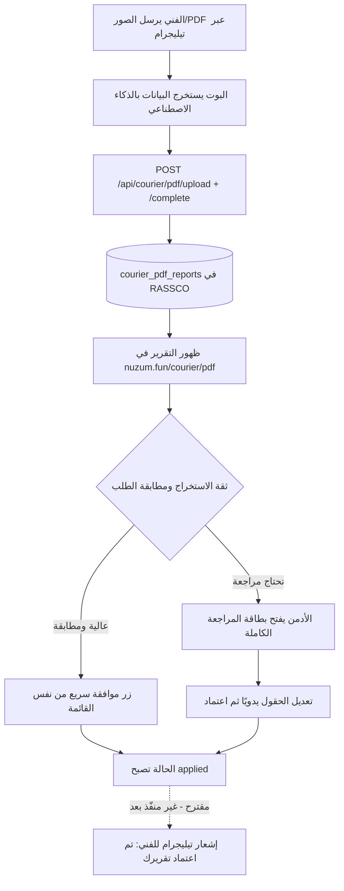

# خطة تطوير صفحة تقارير courier/pdf وربطها الكامل مع بوت تيليجرام

## نظرة عامة

هذه الوثيقة تلخّص الوضع الحالي لتكامل بوت تيليجرام (`@stockpro_installation_bot`) مع قسم `courier/pdf` في RASSCO، وتضع خطة المرحلة القادمة: إغلاق حلقة التواصل مع الفني عبر إشعارات تيليجرام آلية عند اعتماد أو رفض تقريره. الجزء الأول من هذه الخطة (الاستخراج، الرفع التلقائي، فلاتر المراجعة الإدارية) منفّذ فعليًا على فرع `erp-008-phase-2-financial-integrity`، والجزء الثاني (الإشعارات) لا يزال مقترحًا بانتظار قرارين بسيطين موضّحين في نهاية الوثيقة.

## مخطط تدفق العمل الكامل

بمعنى أن كل صندوق حتى J مبني ويعمل فعليًا اليوم، والصندوق الأخير (K) هو الإضافة المقترحة في هذه الخطة.

## ما تم إنجازه فعليًا

الفني لم يعد يحتاج فتح أي واجهة ويب على الإطلاق. البوت يستخرج بيانات كل جهاز من الصور أو ملف PDF المرسل، يرفع الملف الأصلي مباشرة إلى `POST /api/courier/pdf/upload`، ثم يكمل التطبيق عبر `POST /api/courier/pdf/{id}/complete` بمصفوفة الأجهزة كاملة. المصادقة تمر عبر مفتاح خدمة داخلي (`INTERNAL_SERVICE_KEY`) مرفق بهيدر `x-telegram-user-id`، والذي يحلّه الـ backend إلى صاحب الحساب الفعلي في جدول `users` عبر عمود `telegram_user_id` الجديد، بدل أن تُنسب كل التقارير لحساب بوت عام واحد. هذا يعني أن اسم الفني ورمزه ومنطقته تظهر بشكل صحيح تلقائيًا في كل تقرير يصل عبر تيليجرام.

على مستوى الواجهة، صفحة `courier/pdf` صارت تعرض فلترة حسب المنطقة والفني وحقل بحث حر يغطي رقم الجهاز ورقم الطلب، بالإضافة لعمود يوضح اسم الفني ومنطقته مباشرة في الجدول بدل الاكتفاء برقم مستخدم مجهول. كما أضيف رابط معاينة مباشر للملف الأصلي دون الحاجة لفتح شاشة المراجعة الكاملة، وزر "موافقة" سريع يظهر فقط للتقارير المرتبطة فعليًا بطلب معروف وبثقة استخراج 80% فأعلى، فيطبّق بيانات الاستخراج الحالية بضغطة واحدة بدل المرور بنموذج التعديل الكامل. هذا يجيب مباشرة على أحد سؤاليك: نعم، الاعتماد السريع بنقرة واحدة للحالات المطابقة تمامًا موجود الآن، وليس مجرد اقتراح.

## المرحلة القادمة: إغلاق الحلقة عبر إشعار تيليجرام

الفجوة المتبقية هي أن الفني، بعد إرسال تقريره، لا يعرف متى اعتمده الأدمن فعليًا داخل RASSCO - آخر ما يراه هو رسالة البوت المحلية التي تقول إن التوثيق وصل وقيد المراجعة. الحل المقترح هو أن ينادي الـ backend نفسه (وليس البوت) واجهة Telegram Bot API مباشرة عند نجاح `completePdfReport` أو `applyPdfReport`، لأن الحدث يحدث أصلًا داخل تلك الدالتين ولا داعي لبناء آلية استطلاع (polling) منفصلة من جهة البوت. عمليًا هذا يعني إضافة `TELEGRAM_BOT_TOKEN` إلى بيئة RASSCO نفسها، وقراءة `telegram_user_id` من صاحب التقرير (`uploadedBy`) لتحديد الدردشة المستهدفة، ثم إرسال رسالة تأكيد قصيرة برقم الطلب فور اكتمال الاعتماد.

نفس الآلية تصلح لمسار الرفض، لكن الرفض كمفهوم غير موجود حاليًا في النظام - الحالات المتاحة اليوم هي `pending` و`manual_review` و`applied` و`failed` فقط، وليس فيها حالة "مرفوض من الأدمن مع سبب". لو قررت تفعيل هذا المسار، يحتاج الأمر endpoint جديد (`POST /api/courier/pdf/:id/reject`) يقبل سببًا نصيًا ويحدّث الحالة، بالإضافة لتصميم بسيط لهذا السبب على شكل قائمة أسباب قياسية (مثل "الصورة غير واضحة" أو "الرقم التسلسلي غير مطابق") بدل حقل حر، حتى تبقى الرسالة المرسلة للفني مفيدة وقابلة للتصنيف لاحقًا في التقارير.

## قرارات مطلوبة منك قبل البدء بهذه المرحلة

القرار الأول هو هل تريد فعلًا بناء مسار الرفض مع السبب الآن، أم يكفي حاليًا إشعار الاعتماد فقط ونؤجل الرفض لمرحلة لاحقة بعد ما نشوف كم تقرير فعليًا يحتاج تعديل يدوي بدل رفض كامل. القرار الثاني يخص شكل رسالة تيليجرام نفسها - هل تكتفي بسطر تأكيد بسيط، أم تريدها تتضمن أيضًا رابط مباشر لعرض التقرير المطبَّق داخل RASSCO (يتطلب أن يكون للفني صلاحية دخول أصلًا للموقع، وليس فقط للبوت).

## ملاحظة مهمة حول مسار النشر

كل التعديلات المذكورة أعلاه منفّذة على فرع `erp-008-phase-2-financial-integrity` تحت `apps/portal` و`apps/api`. لاحظت من فحصك المباشر للسيرفر عبر SSH أن الكود المنشور فعليًا على `153.92.211.46` موجود تحت مسار مختلف (`/home/nuzum/htdocs/nuzum.fun/apps/web`). قبل النشر يلزم التأكد أي الفرعين هو المصدر الحقيقي للنشر الحالي، وإلا فالتعديلات ستبقى في الفرع دون أن تنعكس فعليًا على `nuzum.fun` حتى تُدمَج بالطريقة الصحيحة.

## الخطوات التالية

بعد حسم القرارين أعلاه، التنفيذ يشمل: إضافة `TELEGRAM_BOT_TOKEN` لبيئة RASSCO، دالة إرسال رسالة تيليجرام بسيطة تُستدعى من نهاية `completePdfReport` (ومن `applyPdfReport` لو أردنا تغطية مسار التطبيق اليدوي القديم أيضًا)، وإن اخترتم مسار الرفض، إضافة الـ endpoint والحالة الجديدة وربطها بواجهة المراجعة الكاملة بزر "رفض" بجانب زر "إكمال جميع الأجهزة" الموجود حاليًا.
