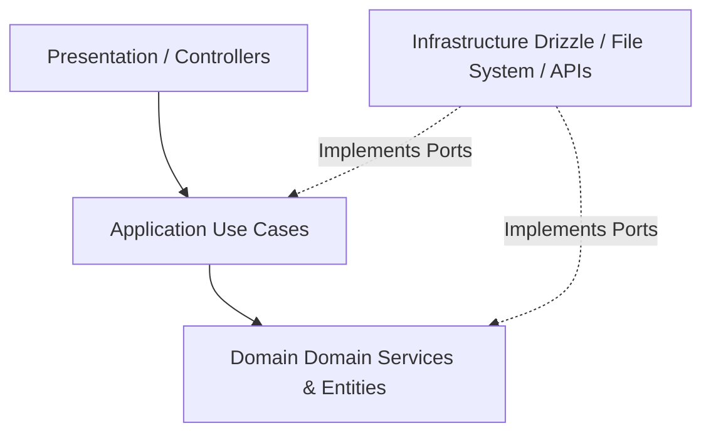
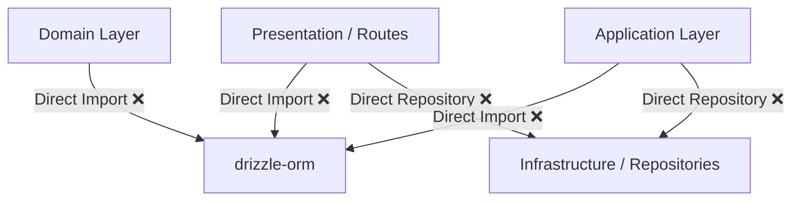
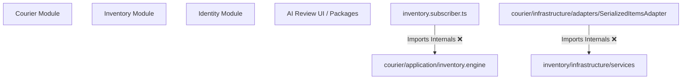

# ERP-005A — Module Dependency & Architecture Map

This document visualizes and maps the current coupling of architectural layers and business modules across the StockPro API and Portal systems.

---

## 📐 1. Layer Dependency Graph

The target dependency flow is strict top-down:
`Presentation (HTTP) ➔ Application (Use Cases) ➔ Domain (Entities/Interfaces) ➔ Infrastructure (Drizzle/Providers)`

### Target Architecture

### Current Reality (Violated Architecture)

---

## 📦 2. Module Dependency Graph

The modules inside `apps/api/src/modules/` are designed to be independent domain boundaries.

---

## 📁 3. Configuration Sources Map

Environment variables and operational parameters must reside in a single source of truth (SSOT). Currently, they are loaded across:
1. `apps/api/src/core/config/config.service.ts` (Standard Wrapper)
2. `process.env` accessed directly inside `drizzle.config.ts`
3. Domain / Infrastructure providers directly utilizing `process.env` values.

---

## 📡 4. Frontend API Access Map

The frontend components in `apps/portal/src` communicate with the backend.
* **Current status**: Direct axios calls scattered inside multiple page components (e.g. `apps/portal/src/pages/`) with hardcoded API URLs.
* **Target state**: Centrally register endpoints inside a dedicated `apps/portal/src/shared/api/` folder using react-query mutations and queries.
